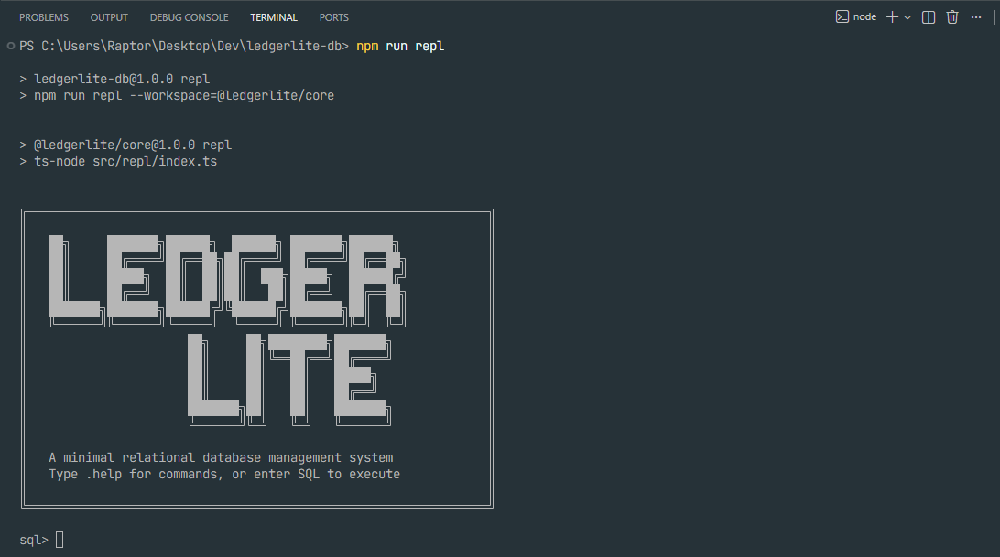
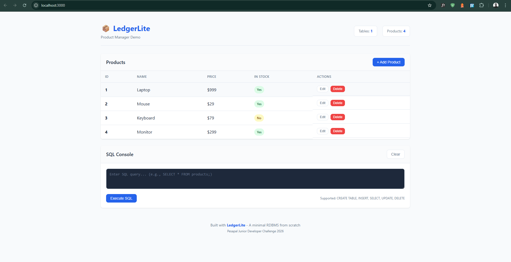

# LedgerLite

<div align="center">


**A minimal relational database management system built from scratch**

*Pesapal Junior Developer Challenge 2026*

</div>

---

## 🎯 Overview

LedgerLite is a fully functional, minimal RDBMS built from scratch in TypeScript. It demonstrates the core mechanics of relational databases including storage, indexing, query parsing, and join execution — all without external database engines or ORMs.

### Why LedgerLite?

Modern developers interact with databases through layers of abstraction. LedgerLite peels back those layers to reveal how a database actually works:

- **Educational**: Understand query parsing, execution, and storage
- **Transparent**: Clean, readable, well-documented code
- **Practical**: Includes a working REPL and web demo

## ✨ Features

- **SQL-like Interface** with interactive REPL
- **In-Memory Row-Based Storage** with optional persistence
- **Table Schemas** with type enforcement (INT, TEXT, BOOL)
- **Constraints**: PRIMARY KEY and UNIQUE
- **Hash-Based Indexing** for O(1) primary key lookups
- **INNER JOIN Support** with nested-loop implementation
- **Web Demo** showing CRUD operations

## 🚀 Quick Start

### Prerequisites

- Node.js 18+ 
- npm or yarn

### Installation

```bash
# Clone the repository
git clone https://github.com/jesse-jacks0n/ledgerlite-db.git
cd ledgerlite-db

# Install dependencies
npm install

# Build the project
npm run build
```

### Start the REPL

```bash
npm run repl
```



### Start the Web Demo

```bash
npm run demo
# Open http://localhost:3000
```



## 📖 Supported SQL

### CREATE TABLE

```sql
CREATE TABLE users (
  id INT PRIMARY KEY,
  name TEXT,
  email TEXT UNIQUE,
  active BOOL
);
```

### INSERT

```sql
INSERT INTO users (id, name, email, active) 
VALUES (1, 'Alice', 'alice@example.com', TRUE);
```

### SELECT

```sql
-- Select all
SELECT * FROM users;

-- Select specific columns
SELECT name, email FROM users;

-- With WHERE clause
SELECT * FROM users WHERE id = 1;
```

### INNER JOIN

```sql
SELECT users.name, orders.total 
FROM users 
INNER JOIN orders ON users.id = orders.user_id;
```

### UPDATE

```sql
UPDATE users SET active = FALSE WHERE id = 1;
```

### DELETE

```sql
DELETE FROM users WHERE id = 1;
```

### Utility Commands (REPL)

```sql
SHOW TABLES;
DESCRIBE users;
```

## 🏗️ Architecture

```
ledgerlite-db/
├── packages/
│   ├── core/                 # LedgerLite RDBMS
│   │   ├── src/
│   │   │   ├── types/        # Type definitions
│   │   │   ├── storage/      # Database & Table storage
│   │   │   ├── index/        # Hash-based indexing
│   │   │   ├── parser/       # SQL tokenizer & parser
│   │   │   ├── engine/       # Query executor
│   │   │   ├── join/         # Join implementation
│   │   │   └── repl/         # Interactive CLI
│   │   └── package.json
│   │
│   └── web-demo/             # CRUD web application
│       ├── src/
│       │   ├── server/       # HTTP server
│       │   └── public/       # Frontend assets
│       └── package.json
│
├── docs/                     # Documentation
└── package.json              # Workspace root
```

### Component Architecture

```
┌─────────────────────────────────────────────────────────────────┐
│                         Client Layer                            │
├─────────────────────────────────────────────────────────────────┤
│     REPL (CLI)          │           Web Demo (HTTP)             │
└─────────────────────────┴───────────────────────────────────────┘
                                    │
                                    ▼
┌─────────────────────────────────────────────────────────────────┐
│                       Query Interface                           │
├─────────────────────────────────────────────────────────────────┤
│                     QueryExecutor.execute(sql)                  │
└─────────────────────────────────────────────────────────────────┘
                                    │
                    ┌───────────────┴───────────────┐
                    ▼                               ▼
┌───────────────────────────────────┐   ┌─────────────────────────────┐
│          Parser                   │   │       Join Engine           │
├───────────────────────────────────┤   ├─────────────────────────────┤
│  Tokenizer → Parser → AST         │   │  innerJoin(left, right,     │
│                                   │   │            condition)       │
└───────────────────────────────────┘   └─────────────────────────────┘
                    │                               │
                    └───────────────┬───────────────┘
                                    ▼
┌─────────────────────────────────────────────────────────────────┐
│                      Storage Engine                             │
├─────────────────────────────────────────────────────────────────┤
│  Database                                                       │
│  ├── Table (users)                                              │
│  │   ├── Schema                                                 │
│  │   ├── Rows (Map<rowId, InternalRow>)                         │
│  │   └── Indexes (Map<columnName, HashIndex>)                   │
│  └── Table (orders)                                             │
│      └── ...                                                    │
└─────────────────────────────────────────────────────────────────┘
                                    │
                                    ▼
┌─────────────────────────────────────────────────────────────────┐
│                      Persistence (Optional)                     │
├─────────────────────────────────────────────────────────────────┤
│              JSON serialization to disk                         │
└─────────────────────────────────────────────────────────────────┘
```

### Module Overview

| Module | Purpose |
|--------|---------|
| **types** | TypeScript interfaces and type definitions |
| **storage** | In-memory table and database management |
| **index** | Hash-based indexing for fast lookups |
| **parser** | SQL tokenization and parsing to AST |
| **engine** | Query execution against storage |
| **join** | INNER JOIN implementation |
| **repl** | Interactive command-line interface |

## 🔧 How It Works

### 1. Parser
The parser uses a two-phase approach:
1. **Tokenizer**: Converts SQL text into tokens (keywords, identifiers, literals)
2. **Parser**: Builds an AST (Abstract Syntax Tree) from tokens

### 2. Query Executor
Receives the parsed AST and:
1. Validates table and column references
2. Checks if indexes can be used
3. Executes the operation against storage
4. Returns structured results

### 3. Storage Engine
- **Tables**: Store rows with schema enforcement
- **Rows**: Internal row IDs enable stable references
- **Indexes**: Automatically maintained on write operations

### 4. Indexing
- Hash-based indexes on PRIMARY KEY and UNIQUE columns
- O(1) average-case lookups
- Automatically used when WHERE targets indexed columns

### 5. Joins
- Nested-loop INNER JOIN
- Uses indexes when available on join columns
- Time complexity: O(n × m) without index, O(n × k) with index

## 🎮 REPL Commands

| Command | Description |
|---------|-------------|
| `.help` | Show help message |
| `.tables` | List all tables |
| `.describe <table>` | Show table structure |
| `.save [path]` | Save database to file |
| `.load [path]` | Load database from file |
| `.clear` | Clear screen |
| `.quit` | Exit REPL |

## 🌐 Web Demo API

| Endpoint | Method | Description |
|----------|--------|-------------|
| `/api/products` | GET | List all products |
| `/api/products/:id` | GET | Get product by ID |
| `/api/products` | POST | Create product |
| `/api/products/:id` | PUT | Update product |
| `/api/products/:id` | DELETE | Delete product |
| `/api/sql` | POST | Execute raw SQL |
| `/api/stats` | GET | Database statistics |

## ⚠️ Limitations & Trade-offs

### Not Supported (by design)
- Aggregations (COUNT, SUM, AVG, etc.)
- ORDER BY / GROUP BY
- Subqueries
- Transactions
- Concurrency control
- NULL handling in comparisons

### Trade-offs Made
| Decision | Trade-off |
|----------|-----------|
| In-memory storage | Fast but limited by RAM, no durability without explicit save |
| Hash indexes only | O(1) lookups but no range queries |
| Nested-loop joins | Simple but O(n×m) complexity |
| No query optimizer | Predictable but not optimal for complex queries |

## 🚀 Future Improvements

With more time, LedgerLite could be extended with:

- [ ] Disk-backed storage (WAL, page-based)
- [ ] B-tree indexes for range queries
- [ ] Query optimizer with cost estimation
- [ ] Basic transactions (BEGIN, COMMIT, ROLLBACK)
- [ ] Connection pooling and concurrency
- [ ] Additional SQL features (ORDER BY, LIMIT, etc.)

## 🤖 AI & Attribution

This project was developed with the assistance of AI tools (GitHub Copilot, Claude) for:
- Planning and design discussions
- Code scaffolding and patterns
- Documentation generation

All architectural decisions, implementation choices, and final code were authored and reviewed by the developer. The project represents original work demonstrating understanding of database internals.

## 📄 License

ISC License - See [LICENSE](LICENSE) for details.

---

<div align="center">

**Built with ❤️ for Pesapal Junior Developer Challenge 2026**

</div>
